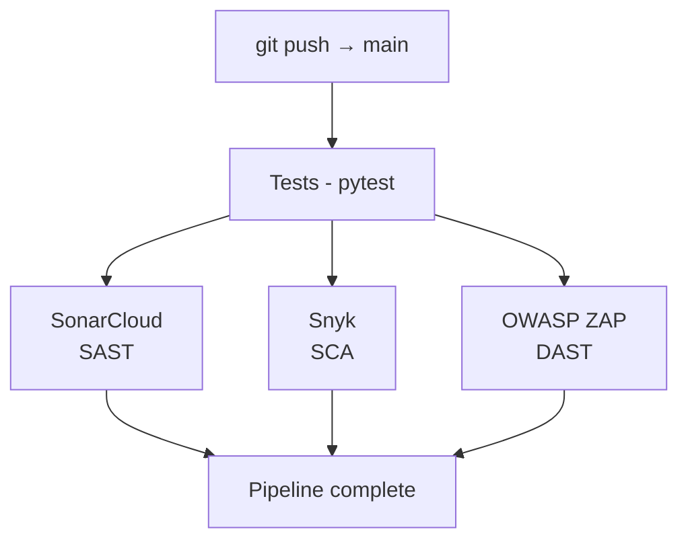

# DevSecOps Pipeline

A CI/CD pipeline with automated security testing for a Python Flask application.

## Pipeline Overview

Every push to `main` triggers the following security checks automatically:
```
Code Push → Tests → SonarCloud (SAST) → Snyk (SCA) → OWASP ZAP (DAST)
```
## Pipeline Diagram


## Security Tools

### SonarCloud — Static Application Security Testing (SAST)
Analyzes the source code on every push to detect vulnerabilities, code smells, and bugs before deployment.

**Finding fixed:** Routes lacked explicit HTTP method declarations, violating the principle of least privilege. Fixed by adding `methods=['GET']` to all endpoints.

### Snyk — Software Composition Analysis (SCA)
Scans `requirements.txt` for known vulnerabilities in third-party dependencies.

**Finding fixed:** `gunicorn==22.0.0` had a high severity vulnerability. Snyk generated the fix PR automatically — updated to a patched version.

### OWASP ZAP — Dynamic Application Security Testing (DAST)
Attacks the running application to detect vulnerabilities that only appear at runtime.

**Findings fixed:** 5 missing HTTP security headers detected and added:
- `X-Content-Type-Options` — prevents MIME type sniffing
- `Content-Security-Policy` — mitigates XSS attacks
- `Permissions-Policy` — restricts access to browser features
- `Cross-Origin-Resource-Policy` — prevents cross-origin data leaks
- `Cache-Control` — prevents sensitive data caching

## Security Decisions in the Dockerfile

**Multi-stage build** — separates build and runtime environments, reducing the attack surface by excluding build tools from the final image.

**Non-root user** — the container runs as `appuser` instead of `root`, limiting the blast radius if the application is compromised.

## Project Structure
```
devsecops-pipeline/
├── app/
│   ├── __init__.py       # App factory
│   └── routes.py         # Endpoints with security headers
├── tests/
│   └── test_app.py       # Pytest test suite
├── .github/
│   └── workflows/
│       └── pipeline.yml  # CI/CD pipeline definition
├── Dockerfile            # Multi-stage, non-root build
├── sonar-project.properties
└── requirements.txt
```
## Running Locally
```bash
# Install dependencies
pip install -r requirements.txt

# Run tests
python -m pytest tests/ -v

# Run with Docker
docker build -t devsecops-demo .
docker run -p 5000:5000 devsecops-demo
```

## Pipeline Results
